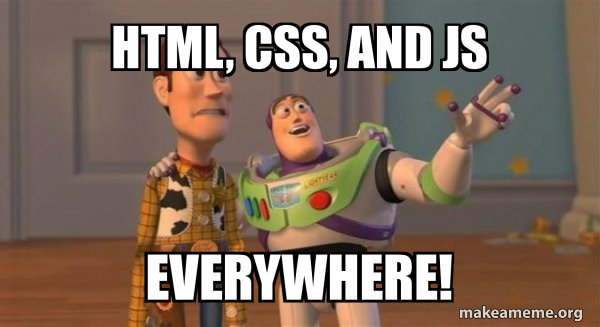
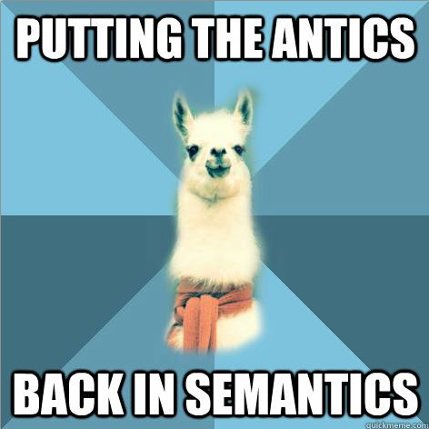

# Introduction to Development

## Overview

Welcome to Code 201! In this class, we're going to be reviewing the basics of HTML, CSS, and JavaScript, along with getting our systems setup to do professional web development.

## Class Outline

- Orientation
- Overview of 201
- Review of Canvas and class syllabus
- Review GitHub repository (repo) for class
- Discussion of terminal commands
- Discussion of text editor and settings in VSCode
- Lab prep

## Learning Objectives

### Students will be able to

#### Describe and Define

- HTML
- CSS
- JavaScript
- VSCode
- Command Line Interface (CLI) Operations
- GitHub

#### Execute

- Create an HTML page from scratch, with proper HTML5 hierarchical structure conventions.
- Include a `<script>` tag in an HTML document that will interact with the user via prompt/alert.
- Write JavaScript that will interact with the user via prompt and alert.
- Use the command line to create and change directories, create and list files, and open files in a text editor or in a web browser.
- Install & use plugins in a text editor, including a JavaScript linter.

## Notes

### Unix & Git

Introduction to core the concepts of file management from the command line and the fundamentals of Git and GitHub.

- `pwd` = print working directory
- `tree` = shows the file tree of your directory
- `ls` = list all the files and folders located in your current directory
- `ls -a` = list all the files and folders located in your current directory including hidden files in short form
- `ls -la` = list all the files and folders located in your current directory including hidden files in a more detailed form
- `cd` = change directory
- `mkdir` = make directory
- `touch` = create a new file
- `code <filename>` = open up this file in VSCode
- `code .` = open the current directory in VSCode
- `mv` = move a file
- `rm <filename>` = remove a file permanently. Warning: there is no recovery!
- `cp <source> <destination>` = copy a file

### Set up a JavaScript linter

1. To setup your linter, start by opening your terminal.
1. Type `cd` and hit enter to navigate to your home directory. You may already be there.
1. Type `code .eslintrc.json`, which will create a new file called `.eslintrc.json` in your home dir, and open it in VSCode.
1. Paste the contents of the `.eslintrc.json` file located in the root of the class repository.

### Additional VSCode Settings

In the lower left-hand corner of VSCode, click on the gear icon and select "Settings". Use the search functionality to set the following values:

- "editor.tabSize" should be set to 2
- "editor.detectIndentation" should be set to true
- "editor.wordWrap" should be set to "on"

